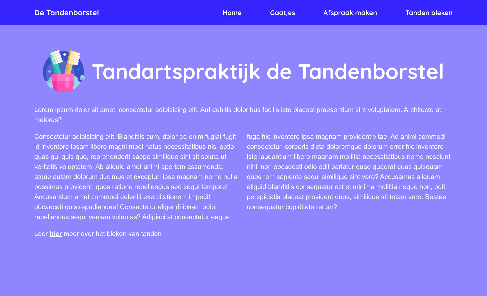

# 🪥 React Router Exercise: Tandartspraktijk de Tandenborstel – NOVI Frontend Module

This repository contains my solution for the React Router exercise from the Frontend Development module at [Novi University](https://www.novi.nl).  
The goal of this assignment is to practice implementing **client-side routing** in React by using **React Router Dom** to create a multi-page website for a fictional dental practice.

The app demonstrates how to set up routes, use navigation links with active styling, and handle programmatic navigation with event handlers.

## Table of Contents

- [Tech Stack](#tech-stack)
- [Key Features](#key-features)
- [Preview](#preview)
- [Project Setup](#project-setup)
- [Credits](#credits)
- [License](#license)

---

## Tech Stack

- **React** (v18.2.0)
- **React Router Dom** (v6.x)
- **Vite**
- **HTML5**
- **CSS3**
- **JavaScript ES6+**
- **Node.js** & **NPM**

---

## Key Features

- React Router Dom installed and set up to enable client-side routing.
- Routes configured for four pages:
    - Home page at `/`
    - Appointments page at `/afspraken`
    - Cavities page at `/gaatjes`
    - Whitening page at `/tanden-bleken`
- Navigation menu implemented with `NavLink` components for clickable navigation and active styling.
- Clickable links in page content that navigate users to relevant pages.
- Active menu item styled with underline and color change using CSS classes passed to `NavLink`.
- Functional button on the cavities page that:
    - Calls an external click handler function.
    - Logs a message `"We gaan direct door naar de afspraken pagina!"` to the console.
    - Navigates the user to the appointments page (`/afspraken`).

---

## Preview

<details>
<summary><strong> Dentist De Tandenborstel Screenshot </strong></summary>



</details>


> A dental practice website with multiple pages navigated using React Router Dom, including dynamic active menu styling and programmatic navigation.

---

## Project Setup

1. Clone or open the repository in an IDE

2. Install dependencies
   ```bash
   npm install
   ```
3. Start the development server
   ```bash
   npm run dev
   ```
4. Open your browser at http://localhost:5173 to view the app.


## Credits

> This assignment, visual designs and base project setup were created and provided by **Novi University** as part of the Frontend module.

---

## License

> "This project is for **educational purposes only**. All images, designs, and dummy content are to be used for learning and non-commercial use."

---